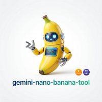

# gemini-nano-banana-tool 🍌

<div align="center">
  
  <br>
  <br>

[](https://www.python.org/downloads/)
[](https://opensource.org/licenses/MIT)
[](https://github.com/astral-sh/ruff)
[](https://github.com/python/mypy)
[](https://www.anthropic.com/claude)
[](https://www.anthropic.com/claude)
[](https://www.anthropic.com/claude/code)

**Gemini Nano Banana Tool** - Professional CLI for generating, editing, and manipulating images using Google's Gemini 2.5 Flash Image model

</div>

## Table of Contents

- [About](#about)
  - [What is Nano Banana?](#what-is-nano-banana)
  - [Why This CLI?](#why-this-cli)
- [Use Cases](#use-cases)
- [Features](#features)
- [Installation](#installation)
- [Configuration](#configuration)
- [Usage](#usage)
  - [Promptgen Command](#promptgen-command)
  - [Generate Command](#generate-command)
  - [List Commands](#list-commands)
- [Library Usage](#library-usage)
- [Resources](#resources)
- [Development](#development)
- [License](#license)

## About

### What is Nano Banana?

**Gemini 2.5 Flash Image** (codename "Nano Banana") is Google's latest AI image generation model that provides:

- 🎨 High-quality text-to-image generation
- 🖼️ Image editing with natural language prompts
- 🔄 Multi-image composition (up to 3 reference images)
- 📐 Multiple aspect ratios (1:1, 16:9, 9:16, and more)
- 🎭 Style transfer and artistic rendering
- ✨ Built-in SynthID watermarking for authenticity

Learn more: [Google Gemini Image Generation Documentation](https://ai.google.dev/gemini-api/docs/image-generation)

### Why This CLI?

This tool provides a **professional, agent-friendly CLI** for Gemini image generation with:

- **🤖 Agent-Friendly Design**: Structured commands and error messages enable AI agents (like Claude Code) to reason and act effectively in ReAct loops
- **🔧 Composable Architecture**: JSON output to stdout, logs to stderr—perfect for pipes and automation
- **📦 Reusable Building Blocks**: Commands serve as building blocks for skills, MCP servers, shell scripts, and workflows
- **🛡️ Type-Safe & Reliable**: Comprehensive type hints and mypy strict mode ensure predictable behavior in automated systems
- **📚 Rich Documentation**: Extensive help messages and error handling guide both humans and agents
- **🎯 Dual-Mode Operation**: Use as CLI tool or import as Python library

## Use Cases

- 🎨 **Creative Content Generation** - Generate marketing visuals, social media content, concept art
- 🖼️ **Image Editing & Enhancement** - Remove objects, change backgrounds, apply style transfers
- 🔄 **Multi-Image Composition** - Combine multiple images for fashion e-commerce, product visualization
- 📐 **Multi-Format Output** - Generate images for various platforms (Instagram, YouTube, TikTok, etc.)
- 🤖 **AI Agent Integration** - Build autonomous image generation workflows with Claude Code
- 🔁 **Batch Processing** - Script generation pipelines with shell loops and automation
- 🧪 **Rapid Prototyping** - Quick visual mockups and design iterations

## Features

- ✅ **AI Prompt Generation** - Transform simple descriptions into detailed prompts using Gemini 2.0 Flash
- ✅ **Prompt Templates** - 6 specialized templates (photography, character, scene, food, abstract, logo)
- ✅ **Text-to-Image Generation** - Create images from detailed text prompts
- ✅ **Image Editing** - Edit existing images with up to 3 reference images
- ✅ **Multiple Aspect Ratios** - Support for 10 different aspect ratios
- ✅ **Flexible Prompt Input** - From argument, file, or stdin
- ✅ **Model Selection** - Choose from multiple Gemini models
- ✅ **Dual Authentication** - Supports both Gemini API key and Vertex AI
- ✅ **Discovery Commands** - List available models and aspect ratios
- ✅ **Type-Safe** - Full type hints with mypy strict mode
- ✅ **Library Mode** - Import and use programmatically
- ✅ **Agent-Ready** - Structured output for AI automation

## Installation

### Prerequisites

- **Python 3.14 or higher**
- **uv** package manager ([installation guide](https://github.com/astral-sh/uv))

### Install from Source

```bash
# Clone the repository
git clone https://github.com/dnvriend/gemini-nano-banana-tool.git
cd gemini-nano-banana-tool

# Install globally with uv
uv tool install .
```

### Install with mise (Recommended for Development)

```bash
cd gemini-nano-banana-tool
mise trust
mise install
uv sync
uv tool install .
```

### Verify Installation

```bash
gemini-nano-banana-tool --version
gemini-nano-banana-tool --help
```

## Configuration

### Gemini Developer API (Recommended)

Set `GEMINI_API_KEY` or `GOOGLE_API_KEY`. The client automatically picks up these variables. If both are set, `GOOGLE_API_KEY` takes precedence.

```bash
export GEMINI_API_KEY='your-api-key'
```

**Get your API key:**

1. Visit [Google AI Studio](https://aistudio.google.com/app/apikey)
2. Create or select a project
3. Generate an API key
4. Set the environment variable

### Gemini API on Vertex AI

For Vertex AI, set the following environment variables:

```bash
export GOOGLE_GENAI_USE_VERTEXAI=true
export GOOGLE_CLOUD_PROJECT='your-project-id'
export GOOGLE_CLOUD_LOCATION='us-central1'
```

**Prerequisites:**

- Google Cloud project with Vertex AI API enabled
- Proper IAM permissions for Vertex AI
- Authenticated with `gcloud auth application-default login`

## Usage

### Promptgen Command

The `promptgen` command transforms simple descriptions into detailed, best-practice prompts using AI.

#### Why Use Promptgen?

Creating effective image generation prompts requires specific knowledge about:
- Photography and composition terminology
- Lighting and technical details
- Artistic styles and techniques
- Color theory and palettes

The `promptgen` command uses Gemini 2.0 Flash to automatically generate detailed, optimized prompts from simple descriptions.

#### Basic Usage

```bash
# Simple description → detailed prompt
gemini-nano-banana-tool promptgen "wizard cat"

# Output:
# A majestic, fluffy Persian cat wearing an ornate, pointed wizard hat
# adorned with celestial symbols, perched upon a stack of ancient,
# leather-bound spellbooks in a dimly lit, gothic library...
```

#### With Templates

Templates apply best practices for specific categories:

```bash
# Character design template
gemini-nano-banana-tool promptgen "wizard cat" --template character

# Food photography template
gemini-nano-banana-tool promptgen "pasta dish" --template food

# Scene composition template
gemini-nano-banana-tool promptgen "cyberpunk city" --template scene
```

Available templates:
- `photography` - Professional photography with technical details
- `character` - Character design with pose and attire
- `scene` - Scene composition with foreground/midground/background
- `food` - Food photography with plating and lighting
- `abstract` - Abstract art with shapes and colors
- `logo` - Logo design with typography

#### Output Formats

```bash
# Plain text (default) - perfect for piping
gemini-nano-banana-tool promptgen "sunset"

# JSON output - for automation and scripts
gemini-nano-banana-tool promptgen "sunset" --json

# Verbose output - educational, shows analysis
gemini-nano-banana-tool promptgen "sunset" --verbose

# Save to file for reuse
gemini-nano-banana-tool promptgen "sunset" -o prompt.txt
```

#### Complete Workflow: Generate Prompt → Create Image

```bash
# Single pipeline: description → prompt → image
gemini-nano-banana-tool promptgen "wizard cat in magical library" | \
  gemini-nano-banana-tool generate --stdin -o wizard-cat.png -a 16:9

# Or save prompt for reuse
gemini-nano-banana-tool promptgen "cyberpunk city at night" \
  --template scene -o city-prompt.txt

gemini-nano-banana-tool generate -f city-prompt.txt -o city1.png -a 16:9
gemini-nano-banana-tool generate -f city-prompt.txt -o city2.png -a 1:1
```

#### List Available Templates

```bash
gemini-nano-banana-tool promptgen --list-templates
```

### Generate Command

The `generate` command creates images from text prompts with optional reference images.

#### Basic Text-to-Image

```bash
# Simple generation with positional argument
gemini-nano-banana-tool generate "A photorealistic cat wearing a wizard hat" -o cat.png

# With specific aspect ratio
gemini-nano-banana-tool generate "Panoramic mountain landscape" -o wide.png --aspect-ratio 16:9
```

#### Prompt from File

```bash
# Read prompt from file
gemini-nano-banana-tool generate -o output.png --prompt-file prompt.txt

# Read from stdin
echo "A beautiful sunset" | gemini-nano-banana-tool generate -o sunset.png --stdin
```

#### Image Editing (Reference Images)

```bash
# Edit with single reference image
gemini-nano-banana-tool generate "Add a birthday hat to the person" -o edited.png \
  --image original.jpg

# Multiple reference images (up to 3)
gemini-nano-banana-tool generate "Put the dress on the model in a garden setting" -o fashion.png \
  --image dress.jpg \
  --image model.jpg
```

#### Different Aspect Ratios

```bash
# Square (Instagram post)
gemini-nano-banana-tool generate "Modern minimalist design" -o square.png --aspect-ratio 1:1

# Landscape (YouTube thumbnail)
gemini-nano-banana-tool generate "Epic cinematic scene" -o landscape.png --aspect-ratio 16:9

# Portrait (Instagram story)
gemini-nano-banana-tool generate "Vertical portrait" -o portrait.png --aspect-ratio 9:16

# Cinematic (ultra-wide)
gemini-nano-banana-tool generate "Sci-fi panorama" -o cinema.png --aspect-ratio 21:9
```

#### Verbosity Levels

```bash
# Normal mode (warnings only)
gemini-nano-banana-tool generate "test" -o output.png

# Verbose mode (INFO level) - show high-level operations
gemini-nano-banana-tool generate "test" -o output.png -v

# Debug mode (DEBUG level) - show detailed validation and API calls
gemini-nano-banana-tool generate "test" -o output.png -vv

# Trace mode (DEBUG + library internals) - show full HTTP requests and library logs
gemini-nano-banana-tool generate "test" -o output.png -vvv
```

#### Model Selection

```bash
# Use specific model
gemini-nano-banana-tool generate "Your prompt" -o output.png \
  --model gemini-2.0-flash-exp

# Default model is gemini-2.5-flash-image
```

#### Complete Options

```bash
gemini-nano-banana-tool generate [PROMPT] [OPTIONS]

Arguments:
  PROMPT                         Text prompt (mutually exclusive with --prompt-file and --stdin)

Options:
  -o, --output PATH              Output image file path [required]
  -f, --prompt-file PATH         Read prompt from file
  -s, --stdin                    Read prompt from stdin
  -i, --image PATH               Reference image (can be used up to 3 times)
  -a, --aspect-ratio TEXT        Aspect ratio (default: 1:1)
  -m, --model TEXT               Gemini model (default: gemini-2.5-flash-image)
  --api-key TEXT                 Override API key from environment
  --use-vertex                   Use Vertex AI instead of Developer API
  --project TEXT                 Google Cloud project (for Vertex AI)
  --location TEXT                Google Cloud location (for Vertex AI)
  -v, --verbose                  Multi-level verbosity (-v INFO, -vv DEBUG, -vvv TRACE)
  --help                         Show this message and exit
```

### List Commands

#### List Available Models

```bash
gemini-nano-banana-tool list-models
```

Output:
```
Available Gemini Image Generation Models:
  • gemini-2.5-flash-image (default) - Fast, high-quality image generation
  • gemini-2.0-flash-exp - Experimental features
  • gemini-1.5-pro - Higher quality, slower generation
  • gemini-1.5-flash - Fast generation
```

#### List Aspect Ratios

```bash
gemini-nano-banana-tool list-aspect-ratios
```

Output:
```
Available Aspect Ratios:
  1:1    (1024x1024)  - Square (Instagram post, social media)
  16:9   (1344x768)   - Widescreen (YouTube thumbnail, desktop)
  9:16   (768x1344)   - Vertical (Instagram story, TikTok, mobile)
  4:3    (1184x864)   - Traditional (classic photography)
  3:4    (864x1184)   - Portrait orientation
  3:2    (1248x832)   - DSLR photography
  2:3    (832x1248)   - Portrait photography
  21:9   (1536x672)   - Cinematic (ultra-wide)
  4:5    (896x1152)   - Instagram portrait
  5:4    (1152x896)   - Medium format photography
```

## Library Usage

Import and use programmatically in your Python code:

### Prompt Generation

```python
from gemini_nano_banana_tool import create_client, generate_prompt

# Create client
client = create_client()  # Uses GEMINI_API_KEY from environment

# Generate detailed prompt from simple description
result = generate_prompt(
    client=client,
    description="wizard cat",
    template="character",  # Optional: use template
    style="photorealistic",  # Optional: style hint
)

print(f"Original: {result['original']}")
print(f"Generated Prompt: {result['prompt']}")
print(f"Tokens used: {result['tokens_used']}")

# Use the generated prompt for image generation
detailed_prompt = result['prompt']
```

### Image Generation

```python
from gemini_nano_banana_tool import create_client, generate_image, AspectRatio

# Create client
client = create_client()  # Uses GEMINI_API_KEY from environment

# Generate image from text
result = generate_image(
    client=client,
    prompt="A beautiful sunset over mountains",
    output_path="sunset.png",
    aspect_ratio=AspectRatio.RATIO_16_9,
    model="gemini-2.5-flash-image"
)

print(f"Generated: {result['output_path']}")
print(f"Resolution: {result['resolution']}")
print(f"Tokens used: {result['token_count']}")

# Generate with reference images
result = generate_image(
    client=client,
    prompt="Add a hat to the person",
    output_path="edited.png",
    reference_images=["original.jpg"],
    aspect_ratio=AspectRatio.RATIO_1_1
)
```

### Complete Workflow

```python
from gemini_nano_banana_tool import create_client, generate_prompt, generate_image

# Create client (reuse for multiple operations)
client = create_client()

# Step 1: Generate optimized prompt
prompt_result = generate_prompt(
    client=client,
    description="cyberpunk city at night",
    template="scene"
)

# Step 2: Generate image with optimized prompt
image_result = generate_image(
    client=client,
    prompt=prompt_result['prompt'],
    output_path="cyberpunk-city.png",
    aspect_ratio="16:9"
)

print(f"Image saved: {image_result['output_path']}")
```

### Vertex AI

```python
# Vertex AI client
vertex_client = create_client(
    use_vertex=True,
    project="my-project",
    location="us-central1"
)
```

## Resources

- **Official Documentation**: [Gemini Image Generation Guide](https://ai.google.dev/gemini-api/docs/image-generation)
- **Google AI Studio**: [Get API Key](https://aistudio.google.com/app/apikey)
- **Python SDK**: [google-genai](https://pypi.org/project/google-genai/)
- **Vertex AI**: [Setup Guide](https://cloud.google.com/vertex-ai/docs/start/introduction-unified-platform)

## Development

### Setup Development Environment

```bash
# Clone repository
git clone https://github.com/dnvriend/gemini-nano-banana-tool.git
cd gemini-nano-banana-tool

# Install dependencies
make install

# Show available commands
make help
```

### Available Make Commands

```bash
make install          # Install dependencies
make format           # Format code with ruff
make lint             # Run linting with ruff
make typecheck        # Run type checking with mypy
make test             # Run tests with pytest
make check            # Run all checks (lint, typecheck, test)
make pipeline         # Run full pipeline (format, check, build, install-global)
make build            # Build package
make clean            # Remove build artifacts
```

### Project Structure

```
gemini-nano-banana-tool/
├── gemini_nano_banana_tool/
│   ├── __init__.py              # Public API exports
│   ├── cli.py                   # CLI entry point
│   ├── core/                    # Core library
│   │   ├── __init__.py
│   │   ├── client.py           # Gemini client management
│   │   ├── generator.py        # Image generation logic
│   │   └── models.py           # Data models and constants
│   ├── commands/                # CLI commands
│   │   ├── __init__.py
│   │   ├── generate_command.py
│   │   └── list_commands.py
│   └── utils.py                 # Utilities
├── tests/                       # Test suite
├── pyproject.toml               # Project configuration
├── Makefile                     # Development commands
├── README.md                    # This file
└── CLAUDE.md                    # Developer guide
```

### Code Standards

- Python 3.14+ with modern syntax (`dict`/`list` over `Dict`/`List`)
- Type hints required for all functions
- Docstrings with Args, Returns, Raises sections
- Line length: 100 characters
- Format with `ruff`, type check with `mypy --strict`

## License

This project is licensed under the MIT License - see the [LICENSE](LICENSE) file for details.

## Author

**Dennis Vriend**

- GitHub: [@dnvriend](https://github.com/dnvriend)

## Acknowledgments

- Built with [Click](https://click.palletsprojects.com/) for CLI framework
- Powered by [google-genai](https://pypi.org/project/google-genai/) SDK
- Developed with [uv](https://github.com/astral-sh/uv) for fast Python tooling
- Inspired by [gemini-tts-tool](https://github.com/dnvriend/gemini-tts-tool)

---

**Generated with AI**

This project was created using [Claude Code](https://www.anthropic.com/claude/code), an AI-powered development tool. The CLI-first design philosophy ensures reliable integration with AI agents, automation pipelines, and provides reusable building blocks for image generation workflows.

Made with ❤️ using Python 3.14
